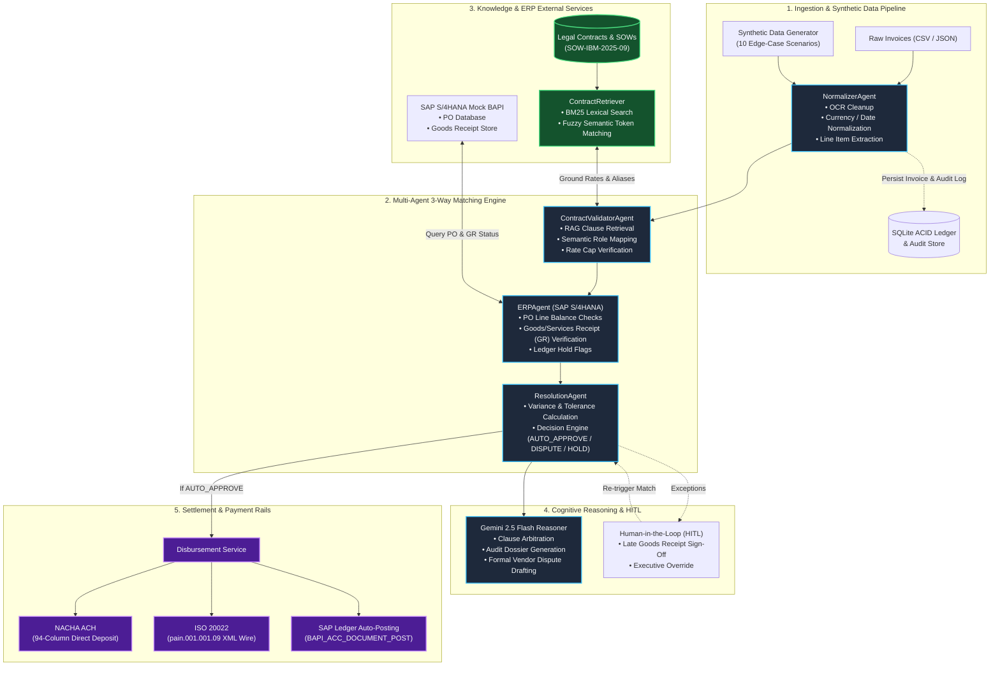
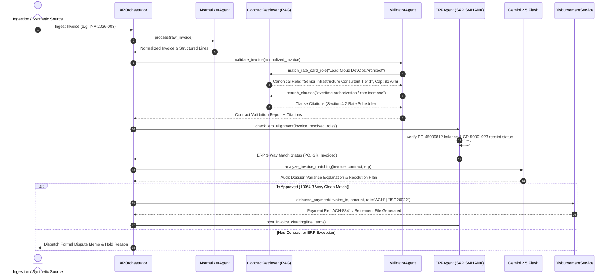

# IBM // FIN_OS (R) — Autonomous AP 3-Way Matching Runtime

> **Enterprise-grade multi-agent financial runtime for automated invoice exception handling, contract grounding via RAG, and autonomous 3-way matching (Invoice vs. PO vs. Goods/Services Receipt vs. Master Services Agreement).**

---

## 📑 Table of Contents

- [Overview & Value Proposition](#-overview--value-proposition)
- [End-to-End System Architecture](#-end-to-end-system-architecture)
- [Multi-Agent Interaction Flow](#-multi-agent-interaction-flow)
- [The Triad: Synthetic Data, RAG & Agentic AI](#-the-triad-synthetic-data-rag--agentic-ai)
  - [1. Synthetic Data & Ingestion Pipeline](#1-synthetic-data--ingestion-pipeline)
  - [2. RAG Contract Grounding](#2-rag-contract-grounding)
  - [3. Agentic AI & Multi-Agent Architecture](#3-agentic-ai--multi-agent-architecture)
- [Automated Settlement Rails (ACH & ISO 20022)](#-automated-settlement-rails-ach--iso-20022)
- [Edge-Case Scenarios Covered](#-edge-case-scenarios-covered)
- [Project Structure](#-project-structure)
- [REST API Reference](#-rest-api-reference)
- [Quickstart Guide](#-quickstart-guide)

---

## 🔭 Overview & Value Proposition

Traditional Accounts Payable (AP) departments waste thousands of manual auditor hours cross-referencing incoming vendor invoices against ERP Purchase Orders (POs), warehouse delivery slips (Goods Receipts), and hundred-page legal contracts (Master Services Agreements / Statements of Work).

**IBM // FIN_OS** automates this entire lifecycle using:
1. **Agentic AI**: Specialized, autonomous software agents that reason, validate, communicate, and take ledger actions.
2. **RAG (Retrieval-Augmented Generation)**: Grounding every financial decision against exact legal clauses and rate card schedules, eliminating hallucinations.
3. **Enterprise Settlement Rails**: Autonomous generation of bank-ready NACHA ACH files and ISO 20022 `pain.001` XML payment instructions upon automated approval.

---

## 🏛️ End-to-End System Architecture



---

## 🔄 Multi-Agent Interaction Flow

The following sequence details how the orchestrator coordinates subagents during invoice reconciliation:



---

## 💡 The Triad: Synthetic Data, RAG & Agentic AI

### 1. Synthetic Data & Ingestion Pipeline

> [!NOTE]
> **Why Synthetic Data?**  
> Accounts payable models cannot be trained or stress-tested directly against live enterprise financial records due to strict data privacy regulations, vendor confidentiality agreements, and the risk of issuing erroneous bank disbursements.

The synthetic data engine (`SyntheticDataGenerator`) produces mathematically consistent, edge-case rich invoice payloads matching complex real-world supply chain scenarios:

1. **Ingestion Modalities**:
   - **Interactive UI Cockpit**: Paste raw JSON/CSV, select preset scenario batches, or upload files directly.
   - **REST API**: `POST /api/data/upload` and `POST /api/data/generate-synthetic`.
   - **CLI Suite**: Automated generation with `python -m src.invoice_matcher.main --all`.
2. **Schema Integrity**:
   - Every invoice is strictly typed using Pydantic models ([`Invoice`](file:///src/invoice_matcher/models/invoice.py) and [`InvoiceLineItem`](file:///src/invoice_matcher/models/invoice.py)).
   - Automatically persisted to SQLite with full audit event stamping (`INVOICE_INGESTED`).

---

### 2. RAG Contract Grounding

> [!IMPORTANT]
> **Eliminating Hallucinations in Financial Auditing**  
> An LLM cannot guess the private rate card or custom SLA penalties negotiated in an enterprise Master Services Agreement. RAG provides the mathematical anchor for every dollar approved or deducted.

- **Hybrid Lexical & Semantic Retrieval**:
  - **BM25 Lexical Index**: Accurately searches exact milestone identifiers (`MS-03`), clause section numbers (`Section 4.2`), and payment term markers (`Net 30`).
  - **Semantic & Fuzzy Matching (`rapidfuzz`)**: Resolves informal vendor terminology to canonical legal contracts. For instance, an invoice line billed as *"Lead Cloud DevOps Architect"* is semantically matched to the contracted title *"Senior Infrastructure Consultant Tier 1"*.
- **Rate Cap & Overcharge Detection**:
  - Compares invoiced hourly rates against contracted rate ceilings. If a vendor bills $195.00/hr against a $170.00/hr contract cap, the system detects the exact $25.00/hr deviation and calculates allowable totals.
- **Contractual Citations in Audit Dossiers**:
  - Every decision is accompanied by verified citations:
    ```
    CITATIONS: SOW-IBM-2025-09 Milestone Schedule: MS-03 - Database Cutover & Hardening ($45,000.00)
    ```

---

### 3. Agentic AI & Multi-Agent Architecture

Rather than relying on brittle rule scripts or single-prompt LLM wrappers, **FIN_OS** decomposes financial compliance into autonomous, collaborative agents:

| Agent | Module | Core Functionality |
| :--- | :--- | :--- |
| **`APOrchestrator`** | [`supervisor.py`](file:///src/invoice_matcher/agents/supervisor.py) | **Central Supervisor**: Governs state transitions across the 3-way matching lifecycle, delegates work, and executes ERP clearance. |
| **`NormalizerAgent`** | [`normalizer_agent.py`](file:///src/invoice_matcher/agents/normalizer_agent.py) | **Data Ingestion Specialist**: Sanitizes raw input, cleans currency symbols, handles OCR errors, and computes line subtotals. |
| **`ValidatorAgent`** | [`validator_agent.py`](file:///src/invoice_matcher/agents/validator_agent.py) | **Legal Compliance Auditor**: Interrogates the RAG retriever to match line items against contracted rate cards and milestones. |
| **`ERPAgent`** | [`erp_agent.py`](file:///src/invoice_matcher/agents/erp_agent.py) | **ERP Specialist**: Simulates SAP S/4HANA BAPI calls to cross-check Purchase Order line amounts, open quantities, and warehouse delivery receipts. |
| **`ResolutionAgent`** | [`resolution_agent.py`](file:///src/invoice_matcher/agents/resolution_agent.py) | **Arbitration Engine**: Computes exact discrepancy amounts, tests tolerance boundaries, and issues automated actions (`AUTO_APPROVE`, `DEDUCTION_DEBIT_MEMO`, `HOLD`). |
| **`GeminiAPReasoner`** | [`gemini_reasoner.py`](file:///src/invoice_matcher/agents/gemini_reasoner.py) | **Cognitive Copilot**: Powered by Gemini 2.5 Flash. Generates structured audit rationales, explains complex exceptions, and composes formal dispute memoranda. |

---

## 💳 Automated Settlement Rails (ACH & ISO 20022)

Once an invoice attains `AUTO_APPROVE` status (or is approved after human sign-off), the **`DisbursementService`** generates bank-ready payment records:

1. **NACHA ACH 94-Column Format** (US Domestic Rails):
   * Full file structure containing File Header (Record Type 1), Company Batch Header (Record Type 5), Entry Detail Record (Record Type 6 - CCD format), Batch Control (Record Type 8), and File Control (Record Type 9).
2. **ISO 20022 `pain.001.001.09` XML** (Global Financial Standard):
   * Universal Financial Industry message scheme supporting SEPA, FedNow, and cross-border SWIFT wire transfers with End-to-End identification (`PmtInf` / `CdtTrfTxInf`).
3. **Payload Inspection & Download**:
   * Inspect and export transaction payloads directly via `/api/payments/{invoice_id}/payload?format=ach|xml`.

---

## 🧪 Edge-Case Scenarios Covered

The built-in synthetic suite covers 10 mission-critical enterprise accounts payable scenarios:

| Scenario Code | Scenario Title | Category | Expected Resolution |
| :--- | :--- | :--- | :--- |
| **SCN-01** | Clean 3-Way Match (Milestone Deliverable) | Standard Invoicing | `AUTO_APPROVE` (100% straight-through clearance) |
| **SCN-02** | Semantic Role Alias (RAG Vector Resolution) | Contract Compliance | `AUTO_APPROVE` (RAG maps alias to canonical role) |
| **SCN-03** | Contract Rate Overcharge (Rate Bump Exception) | Rate Discrepancy | `EXCEPTION_RATE_VARIANCE` ($1,250 debit memo issued) |
| **SCN-04** | Missing Goods/Services Receipt (SAP Hold) | ERP Exception | `EXCEPTION_MISSING_GR` (Placed on hold pending PM sign-off) |
| **SCN-05** | Quantity Overrun Beyond PO Ceiling | Volume Discrepancy | `EXCEPTION_QUANTITY_OVERRUN` (Quantity exceeds PO) |
| **SCN-06** | Volume Rebate & Discount Omission | Pricing Terms | `EXCEPTION_DISCOUNT_OMISSION` (Calculates tier rebate) |
| **SCN-07** | Duplicate Invoice Submission | Fraud / Error | `EXCEPTION_DUPLICATE_INVOICE` (Immediate ledger block) |
| **SCN-08** | Foreign Currency Exchange Variance | FX Compliance | `EXCEPTION_FX_VARIANCE` (Tolerance evaluation) |
| **SCN-09** | Milestone Sequence Dependency Violation | Contract Terms | `EXCEPTION_MILESTONE_PREREQ` (Pre-requisite MS-02 unapproved) |
| **SCN-10** | Expired Master Services Agreement | Legal / Vendor | `EXCEPTION_EXPIRED_CONTRACT` (Contract expired; hold applied) |

---

## 📁 Project Structure

```
├── frontend/                     # Retro-futuristic web dashboard
│   ├── css/style.css             # Cyberpunk/terminal dark theme
│   ├── js/app.js                 # Frontend telemetry, scenarios & modals
│   ├── index.html                # Main AP Simulation Cockpit
│   └── terminal.html             # Dedicated terminal audit interface
├── src/
│   └── invoice_matcher/          # Core Python financial runtime
│       ├── agents/               # Multi-agent orchestrators
│       │   ├── supervisor.py     # APOrchestrator
│       │   ├── normalizer_agent.py
│       │   ├── validator_agent.py
│       │   ├── erp_agent.py
│       │   ├── resolution_agent.py
│       │   └── gemini_reasoner.py # Gemini 2.5 Flash reasoning engine
│       ├── database/             # SQLite ACID storage & audit logger
│       ├── demo_data/            # Synthetic generator & reference datasets
│       ├── erp_service/          # SAP S/4HANA BAPI mock service
│       ├── models/               # Pydantic domain models (Invoice, PO, Contract)
│       ├── payment_rails/        # NACHA ACH & ISO 20022 XML generation
│       ├── rag/                  # Document indexer & hybrid BM25 retriever
│       ├── main.py               # CLI runner
│       └── server.py             # REST API server
├── tests/                        # Comprehensive test suites
│   ├── test_api_endpoints.py
│   ├── test_disbursement_service.py
│   ├── test_gemini_reasoner.py
│   ├── test_iso20022_builder.py
│   ├── test_nacha_generator.py
│   ├── test_rag_retrieval.py
│   └── test_synthetic_and_upload.py
├── package.json                  # Frontend asset build pipeline
└── README.md                     # System documentation
```

---

## 🌐 REST API Reference

| Method | Endpoint | Description |
| :--- | :--- | :--- |
| `GET` | `/api/status` | Runtime status, active agents, settlement rails, and Gemini connection. |
| `GET` | `/api/invoices` | List all processed invoices with matching and payment status. |
| `GET` | `/api/invoices/{id}` | Detailed audit breakdown, PO alignment, and RAG citations for an invoice. |
| `POST` | `/api/match` | Execute live multi-agent 3-way match on a specific invoice ID. |
| `POST` | `/api/pay` | Authorize and execute settlement via `ACH` or `ISO20022`. |
| `POST` | `/api/action/approve-receipt` | Human-in-the-Loop (HITL) Goods Receipt sign-off and instant re-match. |
| `POST` | `/api/action/dispute` | Generate and record a formal vendor rate/deliverable dispute. |
| `POST` | `/api/data/generate-synthetic` | Generate a batch of dynamic synthetic edge cases and ingest into runtime. |
| `POST` | `/api/data/upload` | Upload and ingest custom invoice datasets (CSV or JSON format). |
| `GET` | `/api/payments/{id}/payload` | Download raw generated NACHA ACH or ISO 20022 payment payload. |

---

## 🚀 Quickstart Guide

### Prerequisites
- Python 3.10+
- Node.js 18+ (for frontend bundling)

### 1. Install Dependencies
```bash
# Install Python packages
pip install -r requirements.txt

# Install frontend dependencies
npm install
```

### 2. Configure Environment (Optional for Gemini 2.5 Live Reasoning)
Create a `.env` file in the repository root:
```env
GEMINI_API_KEY="your-gemini-api-key"
```
*(If no API key is provided, the runtime automatically activates deterministic high-fidelity reasoning).*

### 3. Run CLI Simulation
Run all 10 edge-case scenarios through the autonomous pipeline:
```bash
python -m src.invoice_matcher.main --all
```

### 4. Build and Start Web Cockpit
```bash
# Build production frontend bundle
npm run build

# Launch the server
python -m src.invoice_matcher.server
```
Open **[http://localhost:8080](http://localhost:8080)** in your browser to access the **AP Simulation Cockpit**.

### 5. Run Test Suite
```bash
python -m unittest discover tests
```

---

## 🛡️ License

Internal IBM & Academic Project Use.
